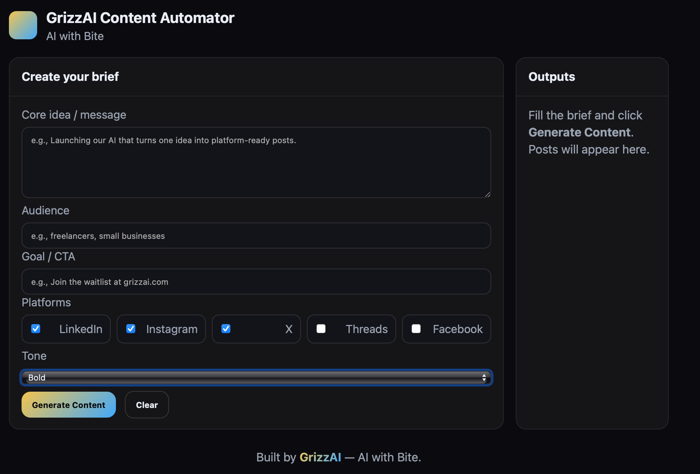

# 🐻 GrizzAI Content Automator — *AI with Bite*
#### Built by **KJ Krueger** — Founder of **GrizzAI**

[👤 Connect with KJ Krueger](https://www.linkedin.com/in/kj-krueger/)  

  

---
### 🌐 **Live App**
👉 [grizzai.github.io/grizzai-content-automator](https://grizzai.github.io/grizzai-content-automator)

---

## 🚀 About the Project
The **GrizzAI Content Automator** turns one marketing idea into optimized posts for multiple platforms — all formatted to fit **LinkedIn, Instagram, X, Threads, and Facebook**.

No frameworks. No backend. Just pure HTML, CSS, and JavaScript running on GitHub Pages — powered by the **OpenAI API**.

GrizzAI is built for creators, freelancers, and small businesses who need *consistent, on-brand content* — fast.

---

## ⚙️ Tech Stack
- **Frontend:** HTML, CSS, JavaScript  
- **AI Engine:** OpenAI Chat Completions API (`gpt-4o-mini`)  
- **Hosting:** GitHub Pages  
- **Brand Colors:** Gold `#f5c542` and Blue `#3aa7ff` on Black `#0b0b0f`  

---

## 🔐 Notes
- The OpenAI API key is stored **locally** in your browser (`localStorage`) for privacy and ease of use.  
- For production or shared links, replace with a secure backend proxy.  
- A `.nojekyll` file prevents GitHub Pages build conflicts (recommended).

---

## 🧠 Example Outputs
Below are real examples generated by the **GrizzAI Content Automator MVP** using the OpenAI API.

---

### 💠 LinkedIn Example
Attention freelancers and small business owners! Are you tired of spending hours crafting social media content? GrizzAI has the solution. Our AI-powered content generator creates engaging posts in a snap. Save time and elevate your online presence.

Join our early-access list and be among the first to experience the future of content creation. Don't miss this opportunity to work smarter, not harder.

**Join the early-access list at grizzai.com (beta)!**  
#ContentCreation #Freelancers #SmallBusiness #SocialMedia #AI

---

### 📸 Instagram Example
Create content faster. Elevate your social media game.  
GrizzAI's AI-powered generator is here for creators.  
Join the early-access list at grizzai.com (beta).  
#ContentCreation #SocialMediaMarketing #Freelancers #SmallBusiness #AI #DigitalMarketing #ContentStrategy #Entrepreneur #MarketingTools #SocialMedia #AIwithBite #ContentGenerator

---

### 🐦 X (Twitter) Example
Create content faster with GrizzAI’s AI-powered generator. Perfect for freelancers and small business owners.  
Join the early-access list today at grizzai.com.  
#ContentCreation #Freelancers

---

## 🪶 Next Steps
✅ Add logo image to `/grizzai-logo-placeholder.png`  
✅ Add optional “Join the Beta” form link  
✅ Polish UI copy & styling  
✅ Begin testing tone variations (Professional / Educational)  

---

## 💪 Built By
**GrizzAI** — *AI with Bite*  
Bold tools for creators, entrepreneurs, and doers.  

---

> © 2025 GrizzAI. All rights reserved.
 🐻 GrizzAI Content Automator — *AI with Bite*

**Live Demo:** [https://grizzai.github.io/grizzai-content-automator/](https://grizzai.github.io/grizzai-content-automator/)

  

<em>AI with Bite — A fast, no-fluff content generator for creators, freelancers, and small businesses.</em>

---

---

## 🚀 About the Project
The **GrizzAI Content Automator** is a one-page, browser-based tool that turns a single marketing idea into ready-to-post content for **multiple platforms at once** — LinkedIn, Instagram, X, Threads, and Facebook.

It uses the OpenAI API to apply **strict native formatting rules** for each platform — enforcing word limits, CTA styling, and smart hashtag sets — all within your browser.  
No backend, no frameworks, no dependencies. Just **pure HTML, CSS, and JS.**

---

## ⚙️ Key Features
✅ **Multi-Platform Generation** — produce posts for 5 platforms in one click  
✅ **Strict Format Rules** — enforces word count, CTA bolding, hashtags per platform  
✅ **Copy-Ready Cards** — each post has a “Copy” button for quick publishing  
✅ **Local API Key Storage** — your key is safely saved in the browser  
✅ **Responsive Dark UI** — gold + blue branding on black, “AI with Bite” theme  
✅ **Error Handling & Loader** — built-in rate limit message and smooth loading animation  

---

## 🧠 How It Works
1. Open the [live app](https://grizzai.github.io/grizzai-content-automator/).  
2. Fill out your **Core Idea**, **Audience**, and **Goal / CTA**.  
3. Select one or more **Platforms**.  
4. Choose your **Tone** (Bold, Professional, Casual, or Educational).  
5. Click **Generate Content** → watch AI-formatted posts appear instantly.  
6. Use **Copy** to grab each post with hashtags included.

---

## 🧩 Tech Stack
- **Frontend:** HTML, CSS, JavaScript  
- **AI Engine:** OpenAI Chat Completions API (`gpt-4o-mini`)  
- **Hosting:** GitHub Pages  

---

## 🔐 Notes
- The OpenAI API key is stored in your browser’s `localStorage` for convenience.  
- If you share the site publicly, use a small proxy to protect your API key.  
- Add a `.nojekyll` file in the repo root (already recommended) to prevent build issues.  

---

## 🦾 Built By
**GrizzAI** — *AI with Bite*  
Bold tools for creators, entrepreneurs, and doers. 

---

## 🧠 Example Outputs

Below are real examples generated by the **GrizzAI Content Automator MVP** using the OpenAI API.

### 🔹 LinkedIn Example
Attention freelancers and small business owners! Are you tired of spending hours crafting social media content? GrizzAI has the solution. Our AI-powered content generator creates engaging posts in a snap. Save time and elevate your online presence.

Join our early-access list and be among the first to experience the future of content creation. Don't miss this opportunity to work smarter, not harder.

Join the early-access list at grizzai.com (beta)!
#ContentCreation #Freelancers #SmallBusiness #SocialMedia #AI

### 📸 Instagram Example

Create content faster. Elevate your social media game.  
GrizzAI's AI-powered generator is here for creators.  
Join the early-access list at grizzai.com (beta).  
#ContentCreation #SocialMediaMarketing #Freelancers #SmallBusiness #AI #DigitalMarketing #ContentStrategy #Entrepreneur #MarketingTools #SocialMedia #AIwithBite #ContentGenerator

### 🐦 X (Twitter) Example

Create content faster with GrizzAI’s AI-powered generator. Perfect for freelancers and small business owners. Join the early-access list today at grizzai.com.  
#ContentCreation #Freelancers
-
---

## ⚡ How It Works

The **GrizzAI Content Automator** takes one simple idea or message and transforms it into fully formatted, platform-ready posts.

1. **Enter your content brief**
   - Core idea or message
   - Audience
   - Goal or call to action
   - Platform selection
   - Tone of voice

2. **Click “Generate Content”**
   - The app connects to the OpenAI API (or uses a built-in simulator for testing).
   - It automatically applies strict formatting rules for each platform.

3. **Review and Copy**
   - Each platform post appears in its own clean card.
   - Use the “Copy” button to grab your post and share it instantly.

💡 *No backend. No accounts. 100% browser-based. Everything runs locally on your device.*

---

## 🧭 Roadmap

This is the **MVP (Minimum Viable Product)** for the GrizzAI Content Automator — now fully live on GitHub Pages.  
Here’s what’s coming next:

- [ ] **Add Beta Signup Form** → Collect user emails directly in-app  
- [ ] **UI Polish Pass** → More gold/blue styling, cleaner spacing  
- [ ] **Results Showcase** → Publicly display real examples and case studies  
- [ ] **User Presets** → Save preferred tones and platform selections  
- [ ] **Monetization Layer** → Package tool tiers and launch GrizzAI Pro  
- [ ] **Full Brand Launch** → LinkedIn + Landing Page integration

---

## 🖼️ Preview (Coming Soon)

  

> *A modern gold-and-blue theme on black — AI with Bite.*

---

## 🏁 Summary

GrizzAI is designed to help creators, freelancers, and small businesses **save time and look professional online** — without spending hours writing posts.

> “Turn one idea into five platform-ready posts — instantly.”

---

## 💪 Built By
**GrizzAI** — *AI with Bite*  
Bold tools for creators, entrepreneurs, and doers.

---

## ✅ MVP Status Update (October 15, 2025)

- **Test Run Completed:** Verified stable outputs for LinkedIn, Instagram, and X.
- **Core Features Working:** Multi-platform generation, tone control, and copy-to-clipboard.
- **Status:** MVP is live and functional. Ready for beta testing.
- **Next Steps:** Begin audience testing via LinkedIn Founder Post.

**Built by GrizzAI — AI with Bite.**

---

> © 2025 GrizzAI. All rights reserved.

