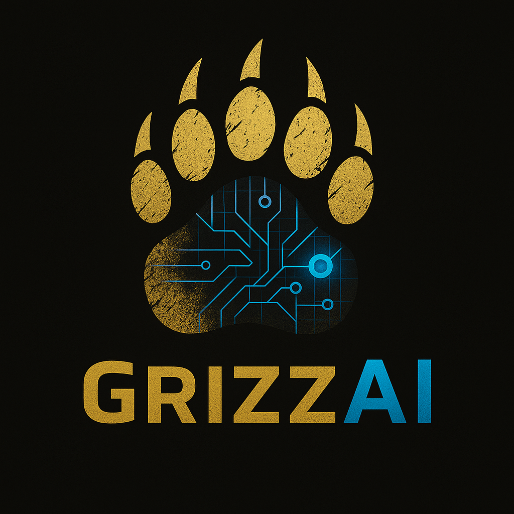

# 🐻 GrizzAI Conten Automator — *AI with Bite*
#### Built by **KJ Krueger** — Founder of **GrizzAI**

[👤 Connect with KJ Krueger](https://www.linkedin.com/in/kj-krueger/)  

    
  

---

### 🌐 **Live App**
👉 [grizzai.github.io/grizzai-content-automator](https://grizzai.github.io/grizzai-content-automator)

---

## 🚀 About the Project
The **GrizzAI Content Automator** is a one-page, browser-based tool that turns a single marketing idea into ready-to-post content for **LinkedIn, Instagram, X, Threads, and Facebook**.

It uses the OpenAI API to apply **strict native formatting rules** for each platform — enforcing word limits, CTA bolding, and smart hashtag sets — all within your browser.

No frameworks. No backend. No dependencies.  
Just **pure HTML, CSS, and JS**, running locally or on **GitHub Pages** — powered by **OpenAI GPT-4o-mini**.

GrizzAI is built for creators, freelancers, and small businesses who need *consistent, on-brand content — fast.*

---

## ⚙️ Key Features
✅ **Multi-Platform Generation** — produce posts for 5 platforms in one click  
✅ **Strict Format Rules** — enforces word count, CTA bolding, hashtags per platform  
✅ **Copy-Ready Cards** — each post has a “Copy” button for instant use  
✅ **Local API Key Storage** — safely saved in your browser  
✅ **Responsive Dark UI** — gold + blue branding on black, “AI with Bite” theme  
✅ **Error Handling & Loader** — built-in rate limit message and smooth “Generating…” animation  

---

## 🧠 How It Works
1. Open the [live app](https://grizzai.github.io/grizzai-content-automator/).  
2. Fill out your **Core Idea**, **Audience**, and **Goal / CTA**.  
3. Select one or more **Platforms**.  
4. Choose your **Tone** (Bold, Professional, Casual, or Educational).  
5. Click **Generate Content** → watch AI-formatted posts appear instantly.  
6. Use **Copy** to grab each post with hashtags included.

💡 *No backend. No accounts. Everything runs locally on your device.*

---

## ⚙️ Tech Stack
- **Frontend:** HTML, CSS, JavaScript  
- **AI Engine:** OpenAI Chat Completions API (`gpt-4o-mini`)  
- **Hosting:** GitHub Pages  
- **Brand Colors:** Gold `#f5c542`, Blue `#3aa7ff`, and Black `#0b0b0f`  

  
  
  

---

## 🧩 Integrations
- **Frontend:** HTML, CSS, JavaScript  
- **AI Engine:** OpenAI API (gpt-4o-mini)  
- **Hosting:** GitHub Pages  

---

## 🧠 Example Outputs
Below are real examples generated by the **GrizzAI Content Automator MVP** using the OpenAI API.

### 🔹 LinkedIn Example
Attention freelancers and small business owners! Are you tired of spending hours crafting social media content? GrizzAI has the solution. Our AI-powered content generator creates engaging posts in a snap. Save time and elevate your online presence.

Join our early-access list and be among the first to experience the future of content creation. Don't miss this opportunity to work smarter, not harder.

**Join the early-access list at grizzai.com (beta)!**  
#ContentCreation #Freelancers #SmallBusiness #SocialMedia #AI

---

### 📸 Instagram Example
Create content faster. Elevate your social media game.  
GrizzAI's AI-powered generator is here for creators.  
Join the early-access list at grizzai.com (beta).  
#ContentCreation #SocialMediaMarketing #Freelancers #SmallBusiness #AI #DigitalMarketing #ContentStrategy #Entrepreneur #MarketingTools #SocialMedia #AIwithBite #ContentGenerator

---

### 🐦 X (Twitter) Example
Create content faster with GrizzAI’s AI-powered generator. Perfect for freelancers and small business owners.  
Join the early-access list today at grizzai.com.  
#ContentCreation #Freelancers

---

## 🧭 Roadmap
This is the **MVP (Minimum Viable Product)** for the GrizzAI Content Automator — now fully live on GitHub Pages.

**Next milestones:**
- [ ] Add **Beta Signup Form** → Collect early user emails  
- [ ] **Polish UI copy & styling** → refine gold/blue balance and spacing  
- [ ] Add **Results Showcase** → display public post examples  
- [ ] Add **User Presets** → save tones and platform preferences  
- [ ] Add **Monetization Layer** → launch GrizzAI Pro tiers  
- [ ] **Full Brand Launch** → integrate LinkedIn Founder Post  

---

## 🧠 Powered By

  
  

---💬 Founder’s Message

I started GrizzAI after life threw me a curveball. A serious injury ended the kind of hands-on work I’d done my whole life — the kind that keeps you moving, sweating, and proud at the end of the day. I didn’t know what I was going to do next. But I wasn’t ready to give up. I started learning about artificial intelligence, the modern-day gold rush, and saw a chance to build something new — something that could give me back what I’d lost: freedom. GrizzAI is my way of taking control again — of turning struggle into creation and helping others do the same.

GrizzAI exists for people who want to take back control — freelancers, small business owners, and creators who are tired of feeling stuck. If AI can make life easier, help someone earn a living, or give them back their time and confidence, then that’s what I want to build. I’ve spent my life fixing things with my hands. Now I get to fix problems with ideas. Helping others do the same — that’s what keeps me going.

A year from now, I see GrizzAI standing on its own — a self-sustaining business that gives me and others the freedom to live life on our own terms. I want to help as many people as I can along the way — people who, like me, just need a way to get back up and keep going. GrizzAI is about more than automation or code. It’s about taking back your independence, doing something that matters, and proving that it’s never too late to rebuild.

If there’s one thing I’ve learned, it’s that life can knock you flat — but you decide if you stay down. GrizzAI is my way of getting back up, and it’s proof that anyone can start over. Whether you’re chasing freedom, rebuilding from nothing, or just trying to make life a little better, I want to help you get there. We’re all in this together — and this is just the start.

## 💪 Built By
**GrizzAI** — *AI with Bite*  
Bold tools for creators, entrepreneurs, and doers.  

---

> © 2025 GrizzAI. All rights reserved.
